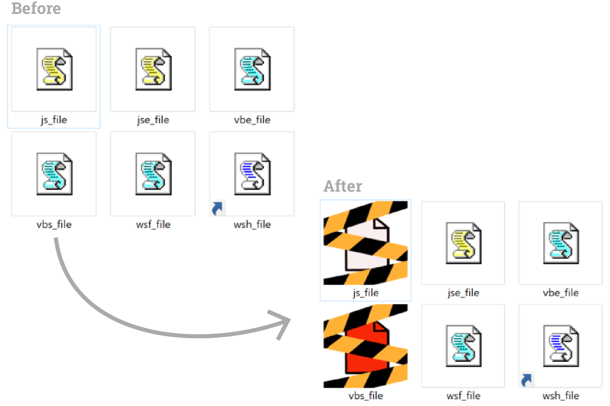
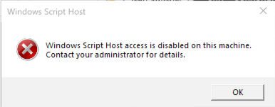

# SAW stop abusing wscript

SAW is a batch utility that tries to decrease the chance of Windows Script Host abuse.
This script can modify some registry keys and also disable both wscript.exe and cscript.exe.
Please use at your own risk.

# Concept

The idea of this script is to reduce the abuse of the scroll icon for js and vbs files. Malicious actors often use them and append .doc to the end of the file name to pass as a word document. This tool basically change the icon of those files to deter users of clicking on them.

This tool is also able to disable or enable wscript.exe and cscript completely with the flag `-d` and `-e` respectively.

# Usage
This scrip must be run as administrator as it changes registry keys.
Basic usage of this script will change the icons:


simply add .ico files to the ICO folder prepended with the file extension (eg: js.ico will change the icon of all js files).
**Supported extensions**:
- .js
- .jse
- .vbe
- .vbs
- .wsf
- .wsh

This tool can also be used to completely disable wscript and users will be presented with the following message when they try to run any file ran by wscript.exe or cscript.exe


Help:
```
SAW stop abusing wscript v1.0

SAW is a batch utility that tries to decrease the chance of Windows Script Host abuse.
This script can modify some registry keys and also disable both wscript.exe and cscript.exe.
Please use at your own risk.

USAGE:
  saw.bat [flags]

  -?, --help               shows this help
  -v, --version            shows the version
  -d, --disable-wscript    disable Windows Script Host
  -e, --enable-wscript     enable Windows script Host
  -nb, --no-backup         does not create a backup
  -b DIR, --backup-dir     define backup directory
                           (default is "bkp" in script directory)
  -r DIR, --restore-dir    define folder where backup is located
                           (default is "bkp" in script direcotry)
  -i DIR, --icon-dir       define folder where icons are located
                           (default is "ICO" in script directory)
```